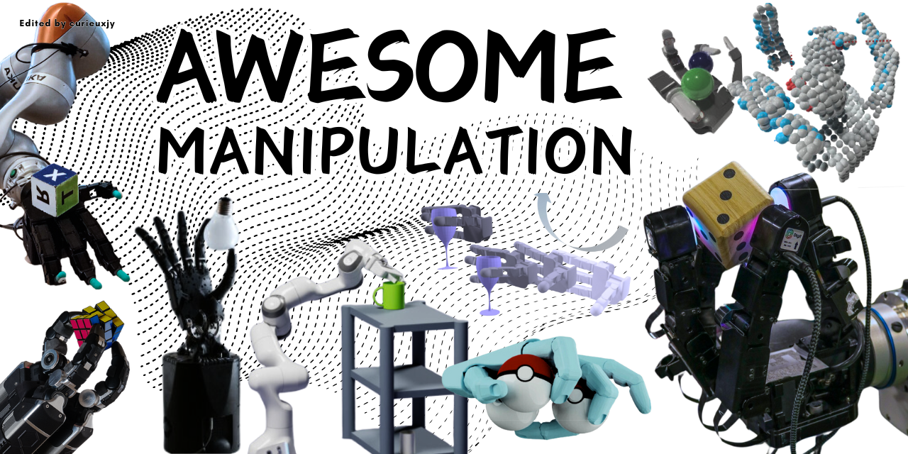

# Awesome_Manipulation

This curation covers a wide range of robotic manipulation tasks. 
> #Gripper #Dexterous #Motion_Generation #Task_Planning #Grasp_Synthesis

**Don't hesitate to leave [issues](https://github.com/curieuxjy/Awesome_Manipulation/issues) or [discussions](https://github.com/curieuxjy/Awesome_Manipulation/discussions) to me if there are any corrections or errors.**

---

# Good to Start 🤓
- [Human-like dexterous manipulation for anthropomorphic five-fingered hands: A review](https://doi.org/10.1016/j.birob.2025.100212)
- [Review on human-like robot manipulation using dexterous hands](https://ietresearch.onlinelibrary.wiley.com/doi/10.1049/ccs2.12073)
- [Review of Learning-Based Robotic Manipulation in Cluttered Environments](https://www.mdpi.com/1424-8220/22/20/7938)
- [A Survey of Embodied Learning for Object-Centric Robotic Manipulation](https://arxiv.org/abs/2408.11537)
- [Learning by Watching: A Review of Video-based Learning Approaches for Robot Manipulation](https://arxiv.org/abs/2402.07127)

---

# Papers 📑
> 🔤 The items below are in alphabetical order.

<b>2025</b>

- [Beyond Behavior Cloning: Robustness through Interactive Imitation and Contrastive Learning](https://arxiv.org/abs/2502.07645)
- [Biohybrid hand actuated by multiple human muscle tissues](https://www.science.org/doi/10.1126/scirobotics.adr5512)
- [DexMOTS: Learning Contact-Rich Dexterous Manipulation in an Object-Centric Task Space with Differentiable Simulation](https://dexmots.github.io/dexmots.pdf) [➕](https://dexmots.github.io/)
- [DexterityGen: Foundation Controller for Unprecedented Dexterity](https://arxiv.org/abs/2502.04307)
- [Dexterous Pre-grasp Manipulation for Human-like Functional Categorical Grasping: Deep Reinforcement Learning and Grasp Representations](https://doi.org/10.1109/TASE.2025.3541768)
- [DOGlove: Dexterous Manipulation with a Low-Cost Open-Source Haptic Force Feedback Glove](https://arxiv.org/abs/2502.07730v1) [➕](https://do-glove.github.io/)
- [Generalizing Safety Beyond Collision-Avoidance via Latent-Space Reachability Analysis](https://arxiv.org/abs/2502.00935)
- [Improving Vision-Language-Action Model with Online Reinforcement Learning](https://arxiv.org/abs/2501.16664)
- [Learning to Transfer Human Hand Skills for Robot Manipulations](https://arxiv.org/abs/2501.04169) [➕](https://rureadyo.github.io/MocapRobot/)
- [Make a Donut: Hierarchical EMD-Space Planning for Zero-Shot Deformable Manipulation with Tools](https://arxiv.org/abs/2311.02787)
- [MuJoCo Playground](https://www.arxiv.org/abs/2502.08844)
- [MuST: Multi-Head Skill Transformer for Long-Horizon Dexterous Manipulation with Skill Progress](https://arxiv.org/abs/2502.02753)
- [Rethinking Latent Representations in Behavior Cloning: An Information Bottleneck Approach for Robot Manipulation](https://arxiv.org/abs/2502.02853)
- [S$^2$-Diffusion: Generalizing from Instance-level to Category-level Skills in Robot Manipulation](https://arxiv.org/abs/2502.09389v2)
- [SAM2Act: Integrating Visual Foundation Model with A Memory Architecture for Robotic Manipulation](https://arxiv.org/abs/2501.18564)
- [Scalable, Training-Free Visual Language Robotics: A Modular Multi-Model Framework for Consumer-Grade GPUs](https://arxiv.org/abs/2502.01071)
- [SKIL: Semantic Keypoint Imitation Learning for Generalizable Data-efficient Manipulation](https://arxiv.org/abs/2501.14400)
- [Universal Actions for Enhanced Embodied Foundation Models](https://arxiv.org/abs/2501.10105)
- [When Pre-trained Visual Representations Fall Short: Limitations in Visuo-Motor Robot Learning](https://arxiv.org/abs/2502.03270)
- [ZeroBP: Learning Position-Aware Correspondence for Zero-shot 6D Pose Estimation in Bin-Picking](https://arxiv.org/abs/2502.01004)

<b>2024</b>

- [3D Diffuser Actor: Policy Diffusion with 3D Scene Representations](https://arxiv.org/abs/2402.10885) [➕](https://3d-diffuser-actor.github.io/)
- [ALPHA-α and Bi-ACT Are All You Need: Importance of Position and Force Information/Control for Imitation Learning of Unimanual and Bimanual Robotic Manipulation with Low-Cost System](https://arxiv.org/abs/2411.09942)
- [AnyRotate: Gravity-Invariant In-Hand Object Rotation with Sim-to-Real Touch](https://arxiv.org/abs/2405.07391) [➕](https://maxyang27896.github.io/anyrotate/)
- [ASID: Active Exploration for System Identification in Robotic Manipulation](https://openreview.net/forum?id=jNR6s6OSBT)
- [AutoMate: Specialist and Generalist Assembly Policies over Diverse Geometries](https://arxiv.org/abs/2407.08028) [➕](https://bingjietang718.github.io/automate/)
- [Avoid Everything: Model-Free Collision Avoidance with Expert-Guided Fine-Tuning](https://openreview.net/pdf/d04a076c1b1b0e51cf759c1e124928c58b22657e.pdf) [➕](https://avoid-everything.github.io/)
- [Behavior Generation with Latent Actions](https://arxiv.org/abs/2403.03181) [➕](https://sjlee.cc/vq-bet/)
- [Bridging the Resource Gap: Deploying Advanced Imitation Learning Models onto Affordable Embedded Platforms](https://arxiv.org/abs/2411.11406)
- [CHG-DAgger: Interactive Imitation Learning with Human-Policy Cooperative Control](https://openreview.net/pdf?id=nWiHRy3ZXy)
- [ClevrSkills: Compositional Language and Visual Reasoning in Robotics](https://arxiv.org/abs/2411.09052)
- [Consistency Policy: Accelerated Visuomotor Policies via Consistency Distillation](https://arxiv.org/abs/2405.07503) [➕](https://consistency-policy.github.io/)
- [DexCap: Scalable and Portable Mocap Data Collection System for Dexterous Manipulation](https://arxiv.org/abs/2403.07788) [➕](https://dex-cap.github.io/)
- [DexDiffuser: Interaction-aware Diffusion Planning for Adaptive Dexterous Manipulation](https://arxiv.org/abs/2411.18562) [➕](https://dexdiffuser.github.io/)
- [DextrAH-G: Pixels-to-Action Dexterous Arm-Hand Grasping with Geometric Fabrics](https://arxiv.org/abs/2407.02274)
- [DeXtreme: Transfer of Agile In-hand Manipulation from Simulation to Reality](https://arxiv.org/abs/2210.13702) [➕](https://dextreme.org/)
- [Diff-Control: A Stateful Diffusion-based Policy for Imitation Learning](https://arxiv.org/html/2404.12539v2) [➕](https://diff-control.github.io/)
- [DIFFTACTILE: A Physics-based Differentiable Tactile Simulator for Contact-rich Robotic Manipulation](https://arxiv.org/abs/2403.08716)
- [Effective Virtual Reality Teleoperation of an Upper-body Humanoid with Modified Task Jacobians and Relaxed Barrier Functions for Self-Collision Avoidance](https://www.arxiv.org/abs/2411.07534)
- [EgoMimic: Scaling Imitation Learning via Egocentric Video](https://arxiv.org/abs/2410.24221)
- [Error-Feedback Model for Output Correction in Bilateral Control-Based Imitation Learning](https://arxiv.org/abs/2411.12255)
- [Exploring the Adversarial Vulnerabilities of Vision-Language-Action Models in Robotics](https://www.arxiv.org/abs/2411.13587)
- [Flow Matching Imitation Learning for Multi-Support Manipulation](https://arxiv.org/abs/2407.12381) [➕](https://hucebot.github.io/flow_multisupport_website/)
- [G3Flow: Generative 3D Semantic Flow for Pose-aware and Generalizable Object Manipulation](https://arxiv.org/abs/2411.18369)
- [Grasp Anything: Combining Teacher-Augmented Policy Gradient Learning with Instance Segmentation to Grasp Arbitrary Objects](https://arxiv.org/abs/2403.10187v1)
- [Grasp Multiple Objects with One Hand](https://arxiv.org/abs/2310.15599)
- [Grasping Diverse Objects with Simulated Humanoids](https://yzhu.io/publication/grasp2024ral/paper.pdf) [➕](https://www.zhengyiluo.com/Omnigrasp-Site/)
- [GraspXL: Generating Grasping Motions for Diverse Objects at Scale](https://arxiv.org/abs/2403.19649) [➕](https://eth-ait.github.io/graspxl/)
- [Hand-Object Interaction Pretraining from Videos](https://arxiv.org/abs/2409.08273) [➕](https://hgaurav2k.github.io/hop/)
- [Instant Policy: In-Context Imitation Learning via Graph Diffusion](https://arxiv.org/abs/2411.12633) [➕](https://www.robot-learning.uk/instant-policy)
- [Kinematic Motion Retargeting for Contact-Rich Anthropomorphic Manipulations](https://arxiv.org/abs/2402.04820)
- [Learning a Shape-Conditioned Agent for Purely Tactile In-Hand Manipulation of Various Objects](https://arxiv.org/abs/2407.18834) [➕](https://aidx-lab.org/manipulation/iros24)
- [Learning Multimodal Behaviors from Scratch with Diffusion Policy Gradient](https://arxiv.org/abs/2406.00681)
- [Learning Precise Affordances from Egocentric Videos for Robotic Manipulation](https://arxiv.org/abs/2408.10123)
- [LEGATO: Cross-Embodiment Imitation Using a Grasping Tool](https://arxiv.org/abs/2411.03682) [➕](https://ut-hcrl.github.io/LEGATO/)
- [Lift3D Foundation Policy: Lifting 2D Large-Scale Pretrained Models for Robust 3D Robotic Manipulation](https://arxiv.org/abs/2411.18623) [➕](https://lift3d-web.github.io/)
- [METRA: Scalable Unsupervised RL with Metric-Aware Abstraction](https://openreview.net/forum?id=c5pwL0Soay)
- [On the Role of the Action Space in Robot Manipulation Learning and Sim-to-Real Transfer](https://arxiv.org/abs/2312.03673)
- [PreAfford: Universal Affordance-Based Pre-Grasping for Diverse Objects and Environments](https://arxiv.org/abs/2404.03634) [➕](https://air-discover.github.io/PreAfford/)
- [RealDex: Towards Human-like Grasping for Robotic Dexterous Hand](https://arxiv.org/abs/2402.13853)
- [RISE: 3D Perception Makes Real-World Robot Imitation Simple and Effective](https://arxiv.org/abs/2404.12281) [➕](https://rise-policy.github.io/)
- [Robot Synesthesia: In-Hand Manipulation with Visuotactile Sensing](https://arxiv.org/abs/2312.01853) [➕](https://yingyuan0414.github.io/visuotactile/)
- [Robots Pre-train Robots: Manipulation-Centric Robotic Representation from Large-Scale Robot Datasets](https://arxiv.org/abs/2410.22325) [➕](https://robots-pretrain-robots.github.io/)
- [Sampling-Based Model Predictive Control for Dexterous Manipulation on a Biomimetic Tendon-Driven Hand](https://arxiv.org/abs/2411.06183)
- [ScissorBot: Learning Generalizable Scissor Skill for Paper Cutting via Simulation, Imitation, and Sim2Real](https://openreview.net/pdf?id=EndKKLLegn)
- [SkillTree: Explainable Skill-Based Deep Reinforcement Learning for Long-Horizon Control Tasks](https://arxiv.org/abs/2411.12173)
- [SPIRE: Synergistic Planning, Imitation, and Reinforcement Learning for Long-Horizon Manipulation](https://arxiv.org/abs/2410.18065) [➕](https://sites.google.com/view/spire-corl-2024)
- [STEER: Flexible Robotic Manipulation via Dense Language Grounding](https://arxiv.org/abs/2411.03409)
- [TacEx: GelSight Tactile Simulation in Isaac Sim - Combining Soft-Body and Visuotactile Simulators](https://arxiv.org/abs/2411.04776)
- [TacSL: A Library for Visuotactile Sensor Simulation and Learning](https://arxiv.org/abs/2408.06506)
- [THE COLOSSEUM: A Benchmark for Evaluating Generalization for Robotic Manipulation](https://arxiv.org/abs/2402.08191) [➕](https://robot-colosseum.github.io/)
- [The Foundational Pose as a Selection Mechanism for the Design of Tool-Wielding Multi-Finger Robotic Hands](https://arxiv.org/abs/2409.14158)
- [The Role of Action Abstractions in Robot Manipulation Learning and Sim-to-Real Transfer](https://openreview.net/pdf?id=oDKc2H00ok)
- [Towards Tight Convex Relaxations for Contact-Rich Manipulation](https://arxiv.org/abs/2402.10312) [➕](https://bernhardgraesdal.com/rss24-towards-tight-convex-relaxations/)
- [Twisting Lids Off with Two Hands](https://arxiv.org/abs/2403.02338)
- [Vegetable Peeling: A Case Study in Constrained Dexterous Manipulation](https://arxiv.org/abs/2407.07884) [➕](https://taochenshh.github.io/projects/veg-peeling)
- [VidMan: Exploiting Implicit Dynamics from Video Diffusion Model for Effective Robot Manipulation](https://arxiv.org/abs/2411.09153)
- [VLMPC: Vision-Language Model Predictive Control for Robotic Manipulation](https://arxiv.org/abs/2407.09829)
- [VQ-ACE: Efficient Policy Search for Dexterous Robotic Manipulation via Action Chunking Embedding](https://arxiv.org/abs/2411.03556) [➕](https://srl-ethz.github.io/page-vq-ace/)
- [WHALE: Towards Generalizable and Scalable World Models for Embodied Decision-making](https://arxiv.org/abs/2411.05619)

<b>2023</b>

- [AnyTeleop: A General Vision-Based Dexterous Robot Arm-Hand Teleoperation System](https://arxiv.org/abs/2307.04577) [➕](https://yzqin.github.io/anyteleop/)
- [Contact Edit: Artist Tools for Intuitive Modeling of Hand-Object Interactions](https://arxiv.org/abs/2305.02051)
- [Deep Reinforcement Learning of Dexterous Pre-grasp Manipulation for Human-like Functional Categorical Grasping](https://arxiv.org/abs/2307.16752)
- [DexDeform: Dexterous Deformable Object Manipulation with Human Demonstrations and Differentiable Physics](https://arxiv.org/abs/2304.03223) [➕](https://sites.google.com/view/dexdeform)
- [General In-Hand Object Rotation with Vision and Touch](https://arxiv.org/abs/2309.09979)
- [Getting the Ball Rolling: Learning a Dexterous Policy for a Biomimetic Tendon-Driven Hand with Rolling Contact Joints](https://arxiv.org/abs/2308.02453) [➕](http://tactilesim.csail.mit.edu/)
- [IndustReal: Transferring Contact-Rich Assembly Tasks from Simulation to Reality](https://arxiv.org/abs/2305.17110) [➕](https://sites.google.com/nvidia.com/industreal)
- [Neural feels with neural fields: Visuo-tactile perception for in-hand manipulation](https://arxiv.org/abs/2312.13469)
- [Perceiving Extrinsic Contacts from Touch Improves Learning Insertion Policies](https://arxiv.org/abs/2309.16652)
- [Rotating without Seeing: Towards In-hand Dexterity through Touch](https://arxiv.org/abs/2303.10880) [➕](https://touchdexterity.github.io/)
- [Tacchi: A Pluggable and Low Computational Cost Elastomer Deformation Simulator for Optical Tactile Sensors](https://arxiv.org/abs/2301.08343)
- [UniDexGrasp++: Improving Dexterous Grasping Policy Learning via Geometry-aware Curriculum and Iterative Generalist-Specialist Learning](https://arxiv.org/abs/2304.00464) [➕](https://pku-epic.github.io/UniDexGrasp++/)
- [Visual Dexterity: In-Hand Reorientation of Novel and Complex Object Shapes](https://arxiv.org/abs/2211.11744)

<b>2022</b>

- [Efficient Tactile Simulation with Differentiability for Robotic Manipulation](https://people.csail.mit.edu/jiex/papers/TactileSim/paper.pdf) [➕](http://tactilesim.csail.mit.edu/)
- [Factory: Fast Contact for Robotic Assembly](https://arxiv.org/abs/2205.03532) [➕](https://sites.google.com/nvidia.com/factory)
- [In-Hand Object Rotation via Rapid Motor Adaptation](https://arxiv.org/abs/2210.04887)
- [Tactile Gym 2.0: Sim-to-real Deep Reinforcement Learning for Comparing Low-cost High-Resolution Robot Touch](https://arxiv.org/abs/2207.10763)

<b>2021</b>

- [A System for General In-Hand Object Re-Orientation](https://arxiv.org/abs/2111.03043)
- [OSCAR: Data-Driven Operational Space Control for Adaptive and Robust Robot Manipulation](https://arxiv.org/abs/2110.00704)
- [ReSkin: versatile, replaceable, lasting tactile skins](https://arxiv.org/abs/2111.00071) [➕](https://reskin.dev/)
- [STORM: An Integrated Framework for Fast Joint-Space Model-Predictive Control for Reactive Manipulation](https://arxiv.org/abs/2104.13542)
- [Tactile-RL for Insertion: Generalization to Objects of Unknown Geometry](https://arxiv.org/abs/2104.01167) [➕](https://sites.google.com/view/tactileinsertion)

<b>2020</b>

- [A Long Horizon Planning Framework for Manipulating Rigid Pointcloud Objects](https://arxiv.org/abs/2011.08177) [➕](https://anthonysimeonov.github.io/rpo-planning-framework/)
- [Cable Manipulation with a Tactile-Reactive Gripper](https://arxiv.org/abs/1910.02860) [➕](http://gelsight.csail.mit.edu/cable/)
- [DIGIT: A Novel Design for a Low-Cost Compact High-Resolution Tactile Sensor with Application to In-Hand Manipulation](https://arxiv.org/abs/2005.14679)
- [Precise and realistic grasping and manipulation in Virtual Reality without force feedback](https://ieeexplore.ieee.org/document/9089499)
- [TACTO: A Fast, Flexible and Open-source Simulator for High-Resolution Vision-based Tactile Sensors](https://arxiv.org/abs/2012.08456)

<b>~ 2019</b>

- [A grasp strategy with the geometric centroid of a groped object shape derived from contact spots](https://ieeexplore.ieee.org/document/6225379)
- [Integration of recognition and planning for robot hand grasping](https://ieeexplore.ieee.org/document/6677505)
- [Learning Complex Dexterous Manipulation with Deep Reinforcement Learning and Demonstrations](https://arxiv.org/abs/1709.10087)

---

# Github 💻

<b>Repositories</b>

-  
-  
-  
-  
-  
-  
-  
-  
-  
-  
-  
-  
-  

---

# Platforms 🦾

| End Effectors             | Arms                |
|------------------------------------------------------------|-------------------------------------------------------------|
| [Allegro Hand](https://www.allegrohand.com/)  | [Franka](https://franka.de/)             |
| [DG-5F](https://en.tesollo.com/DG-5F)                    | [UR](https://www.universal-robots.com/)   |
| [DLR Hand](https://ieeexplore.ieee.org/document/932538/) | [Kossow](https://www.kassowrobots.com/products/7-axis-collaborative-robot-arm-kr-series)                      |
| [Leap Hand](https://arxiv.org/abs/2309.06440)     | [Ufactory](https://www.ufactory.us/xarm)                             |
| [Shadow hand](https://www.shadowrobot.com/dexterous-hand-series/)  | [Kinova](https://www.kinovarobotics.com/)                                |

