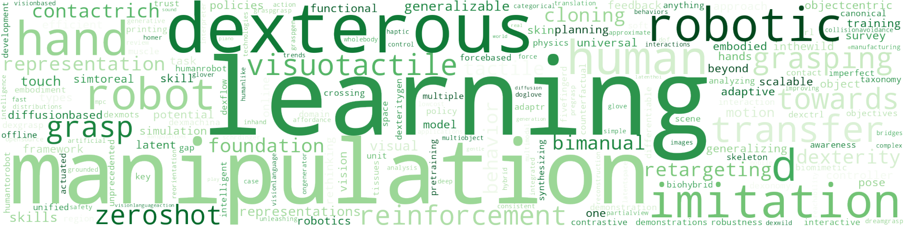
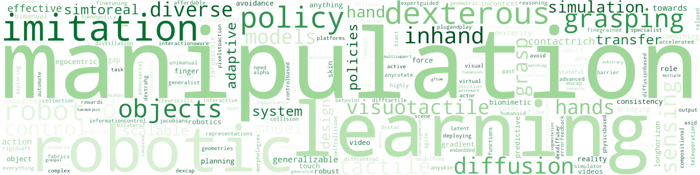
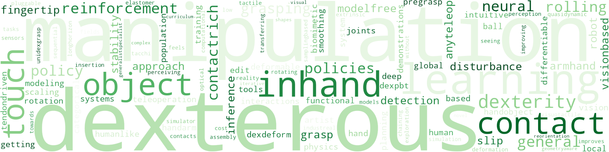

# Awesome_Manipulation

This curation covers a wide range of robotic manipulation tasks. 
> #Gripper #Dexterous #Motion_Generation #Tactile_Sensors #Task_Planning #Grasp_Synthesis #Learning_Methods

**Don't hesitate to leave [issues](https://github.com/curieuxjy/Awesome_Manipulation/issues) or [discussions](https://github.com/curieuxjy/Awesome_Manipulation/discussions) to me if there are any corrections or errors.**

---

# Good to Start 🤓

## Books/Tutorials
- [A Math Cookbook for Robot Manipulation, Prof. Sylvain Calinon](https://calinon.ch/paper1004.htm) - [Website](https://rcfs.ch)
- [A Mathematical Introduction to Robotic Manipulation, Richard Murray](https://dl.acm.org/doi/10.5555/561828)
- [Introduction to Robotics, Prof. Oussama Khatib, Stanford](https://see.stanford.edu/course/cs223a)
- [Introduction to Robotics: Mechanics and Control, John J. Craig](https://elibrary.pearson.de/book/99.150005/9781292164953)
- [Modern Robotics, Prof. Kevin M. Lynch & Prof. Frank C. Park](https://modernrobotics.northwestern.edu/nu-gm-book-resource) - [Textbook](https://hades.mech.northwestern.edu/images/7/7f/MR.pdf)
- [Robot Dynamics Lecture Notes, Robotic Systems Lab, ETH](https://ethz.ch/content/dam/ethz/special-interest/mavt/robotics-n-intelligent-systems/rsl-dam/documents/RobotDynamics2017/RD_HS2017script.pdf)
- [Robotic Manipulation Perception, Planning, and Control, Prof. Russ Tedrake, MIT](https://manipulation.csail.mit.edu)
- [Robotic Systems, Prof. Kris Hauser, University of Illinois](https://motion.cs.illinois.edu/RoboticSystems)
- [Robotics Modelling, Planning and Control, Siciliano et al.](https://link.springer.com/book/10.1007/978-1-84628-642-1)
  - [Robotics Foundations I, Prof. Bruno Siciliano, University of Naples Federico II](https://lms.federica.eu/enrol/index.php?id=470)
  - [Robotics Foundations II, Prof. Bruno Siciliano, University of Naples Federico II](https://lms.federica.eu/enrol/index.php?id=480)
- [ROS-Industrial](https://rosindustrial.org) - [Docs](https://industrial-training-master.readthedocs.io)
  
## Surveys
- [A Survey of Embodied Learning for Object-Centric Robotic Manipulation](https://arxiv.org/abs/2408.11537)
- [A Survey: Learning Embodied Intelligence from Physical Simulators and World Models](https://arxiv.org/abs/2507.00917)
- [A Systematic Review on Custom Data Gloves](https://arxiv.org/abs/2405.15417)
- [Human-like dexterous manipulation for anthropomorphic five-fingered hands: A review](https://doi.org/10.1016/j.birob.2025.100212)
- [Learning by Watching: A Review of Video-based Learning Approaches for Robot Manipulation](https://arxiv.org/abs/2402.07127)
- [Review of Learning-Based Robotic Manipulation in Cluttered Environments](https://www.mdpi.com/1424-8220/22/20/7938)
- [Review on human-like robot manipulation using dexterous hands](https://ietresearch.onlinelibrary.wiley.com/doi/10.1049/ccs2.12073)

---

# Papers 📑
> 🔤 The items below are in alphabetical order.

<b>2025</b>

- ["Stack It Up!": 3D Stable Structure Generation from 2D Hand-drawn Sketch](https://www.arxiv.org/abs/2508.02093)
- [Adapt3R: Adaptive 3D Scene Representation for Domain Transfer in Imitation Learning](https://arxiv.org/abs/2503.04877)
- [AgentWorld: An Interactive Simulation Platform for Scene Construction and Mobile Robotic Manipulation](https://arxiv.org/abs/2508.07770)
- [AhaRobot: A Low-Cost Open-Source Bimanual Mobile Manipulator for Embodied AI](https://arxiv.org/abs/2503.10070)
- [Analyzing Key Objectives in Human-to-Robot Retargeting for Dexterous Manipulation](https://arxiv.org/abs/2506.09384)
- [AnyDexGrasp: General Dexterous Grasping for Different Hands with Human-level Learning Efficiency](https://arxiv.org/abs/2502.16420)
- [ATK: Automatic Task-driven Keypoint Selection for Robust Policy Learning](https://www.arxiv.org/abs/2506.13867)
- [BEHAVIOR Robot Suite: Streamlining Real-World Whole-Body Manipulation for Everyday Household Activities](https://arxiv.org/abs/2503.05652)
- [Beyond Behavior Cloning: Robustness through Interactive Imitation and Contrastive Learning](https://arxiv.org/abs/2502.07645)
- [Beyond Visuals: Investigating Force Feedback in Extended Reality for Robot Data Collection](https://arxiv.org/abs/2503.20714v1)
- [Bio-Skin: A Cost-Effective Thermostatic Tactile Sensor with Multi-Modal Force and Temperature Detection](https://arxiv.org/abs/2503.07989)
- [Biohybrid hand actuated by multiple human muscle tissues](https://www.science.org/doi/10.1126/scirobotics.adr5512)
- [Bunny-VisionPro Real-Time Bimanual Dexterous Teleoperation for Imitation Learning](https://arxiv.org/abs/2407.03162)
- [Canonical Representation and Force-Based Pretraining of 3D Tactile for Dexterous Visuo-Tactile Policy Learning](https://arxiv.org/abs/2409.17549)
- [CDP: Towards Robust Autoregressive Visuomotor Policy Learning via Causal Diffusion](https://arxiv.org/abs/2506.14769)
- [ClutterDexGrasp: A Sim-to-Real System for General Dexterous Grasping in Cluttered Scenes](https://arxiv.org/abs/2506.14317)
- [Cone-E: An Open Source Bimanual Mobile Manipulator for Generalizable Robotics](https://cone-e.com/)
- [Constraint-Preserving Data Generation for Visuomotor Policy Learning](https://arxiv.org/abs/2508.03944)
- [Counterfactual Behavior Cloning: Offline Imitation Learning from Imperfect Human Demonstrations](https://arxiv.org/pdf/2505.10760)
- [Crossing the Human-Robot Embodiment Gap with Sim-to-Real RL using One Human Demonstration](https://arxiv.org/abs/2504.12609)
- [D-CODA: Diffusion for Coordinated Dual-Arm Data Augmentation](https://arxiv.org/abs/2505.04860)
- [DemoSpeedup: Accelerating Visuomotor Policies via Entropy-Guided Demonstration Acceleration](https://arxiv.org/abs/2506.05064)
- [Development of a Five-Fingerd Biomimetic Soft Robotic Hand by 3D Printing the Skin and Skeleton as One Unit](https://arxiv.org/abs/2503.00789)
- [Dex1B: Learning with 1B Demonstrations for Dexterous Manipulation](https://arxiv.org/abs/2506.17198)
- [DexCtrl: Towards Sim-to-Real Dexterity with Adaptive Controller Learning](https://arxiv.org/abs/2505.00991)
- [DexFlow: A Unified Approach for Dexterous Hand Pose Retargeting and Interaction](https://arxiv.org/abs/2505.01083)
- [DexGrasp Anything: Towards Universal Robotic Dexterous Grasping with Physics Awareness](https://arxiv.org/pdf/2503.08257)
- [DexGraspVLA: A Vision-Language-Action Framework Towards General Dexterous Grasping](https://arxiv.org/abs/2502.20900)
- [DexMachina: Functional Retargeting for Bimanual Dexterous Manipulation](https://arxiv.org/abs/2505.24853)
- [DexMOTS: Learning Contact-Rich Dexterous Manipulation in an Object-Centric Task Space with Differentiable Simulation](https://dexmots.github.io/dexmots.pdf) [➕](https://dexmots.github.io/)
- [Dexonomy: Synthesizing All Dexterous Grasp Types in a Grasp Taxonomy](https://arxiv.org/abs/2504.18829)
- [DexSkin: High-Coverage Conformable Robotic Skin for Learning Contact-Rich Manipulation](https://dex-skin.github.io/)
- [DexterityGen: Foundation Controller for Unprecedented Dexterity](https://arxiv.org/abs/2502.04307)
- [Dexterous Contact-Rich Manipulation via the Contact Trust Region](https://www.arxiv.org/abs/2505.02291)
- [Dexterous hand towards intelligent manufacturing: A review of technologies, trends, and potential applications](https://www.researchgate.net/publication/390403129_Dexterous_hand_towards_intelligent_manufacturing_A_review_of_technologies_trends_and_potential_applications)
- [Dexterous Manipulation through Imitation Learning: A Survey](https://arxiv.org/abs/2504.03515)
- [Dexterous Pre-grasp Manipulation for Human-like Functional Categorical Grasping: Deep Reinforcement Learning and Grasp Representations](https://doi.org/10.1109/TASE.2025.3541768)
- [DexTrack: Towards Generalizable Neural Tracking Control for Dexterous Manipulation from Human References](https://arxiv.org/abs/2502.09614)
- [DexVLA: Vision-Language Model with Plug-In Diffusion Expert for General Robot Control](https://arxiv.org/abs/2502.05855)
- [DexWild: Dexterous Human Interactions for In-the-Wild Robot Policies](https://arxiv.org/abs/2505.07813)
- [Diffusion-Based Approximate MPC: Fast and Consistent Imitation of Multi-Modal Action Distributions](https://arxiv.org/pdf/2504.04603)
- [DOGlove: Dexterous Manipulation with a Low-Cost Open-Source Haptic Force Feedback Glove](https://arxiv.org/abs/2502.0773) [➕](https://do-glove.github.io/)
- [DreamGrasp: Zero-Shot 3D Multi-Object Reconstruction from Partial-View Images for Robotic Manipulation](https://arxiv.org/abs/2507.05627)
- [Estimating Value of Assistance for Online POMDP Robotic Agents](https://dyalab.mines.edu/2025/icra-workshop/6.pdf)
- [Extracting Visual Plans from Unlabeled Videos via Symbolic Guidance](https://arxiv.org/abs/2505.08444)
- [Eye, Robot: Learning to Look to Act with a BC-RL Perception-Action Loop](https://arxiv.org/abs/2506.10968)
- [Fabrica: Dual-Arm Assembly of General Multi-Part Objects via Integrated Planning and Learning](https://arxiv.org/abs/2506.05168)
- [FetchBot: Object Fetching in Cluttered Shelves via Zero-Shot Sim2Real](https://arxiv.org/abs/2502.17894)
- [FFHFlow: A Flow-based Variational Approach for Learning Diverse Dexterous Grasps with Shape-Aware Introspection](https://arxiv.org/abs/2407.15161)
- [FoAM: Foresight-Augmented Multi-Task Imitation Policy for Robotic Manipulation](https://arxiv.org/abs/2409.19528)
- [From Real World to Logic and Back: Learning Generalizable Relational Concepts For Long Horizon Robot Planning](https://arxiv.org/abs/2402.11871)
- [From Simple to Complex Skills: The Case of In-Hand Object Reorientation](https://arxiv.org/abs/2501.05439) [➕](https://dexhier.github.io/)
- [Generalizable Humanoid Manipulation with 3D Diffusion Policies](https://arxiv.org/abs/2410.10803)
- [Generalizing Safety Beyond Collision-Avoidance via Latent-Space Reachability Analysis](https://arxiv.org/abs/2502.00935)
- [Generative Artificial Intelligence in Robotic Manipulation: A Survey](https://arxiv.org/pdf/2503.03464)
- [Geometry-aware 4D Video Generation for Robot Manipulation](https://arxiv.org/abs/2507.01099v1)
- [GLOVER++: Unleashing the Potential of Affordance Learning from Human Behaviors for Robotic Manipulation](https://arxiv.org/pdf/2505.11865)
- [GR00T N1: An Open Foundation Model for Generalist Humanoid Robots](https://arxiv.org/abs/2503.14734) + [v1.5](https://research.nvidia.com/labs/gear/gr00t-n1_5/)
- [Grasp-MPC: Closed-Loop Visual Grasping via Value-Guided Model Predictive Control](https://arxiv.org/abs/2509.06201)
- [Grasp2Grasp: Vision-Based Dexterous Grasp Translation via Schrödinger Bridges](https://arxiv.org/abs/2506.02489)
- [GraspGen: A Diffusion-based Framework for 6-DOF Grasping with On-Generator Training](https://arxiv.org/abs/2507.13097)
- [Grounded Vision-Language Interpreter for Integrated Task and Motion Planning](https://arxiv.org/pdf/2506.03270)
- [HOMER: Learning In-the-Wild Mobile Manipulation via Hybrid Imitation and Whole-Body Control](https://arxiv.org/pdf/2506.01185)
- [Humanoid Policy ~ Human Policy](https://arxiv.org/abs/2503.13441)
- [ImMimic: Cross-Domain Imitation from Human Videos via Mapping and Interpolation](https://openreview.net/forum?id=lujxPiu99k)
- [Improving Vision-Language-Action Model with Online Reinforcement Learning](https://arxiv.org/abs/2501.16664)
- [KineDex: Learning Tactile-Informed Visuomotor Policies via Kinesthetic Teaching for Dexterous Manipulation](https://arxiv.org/abs/2505.01974)
- [KineSoft: Learning Proprioceptive Manipulation Policies with Soft Robot Hands](https://arxiv.org/abs/2503.01078)
- [Latent Adaptive Planner for Dynamic Manipulation](https://www.arxiv.org/abs/2505.03077)
- [Latent Theory of Mind: A Decentralized Diffusion Architecture for Cooperative Manipulation](https://arxiv.org/abs/2505.09144)
- [LatentHOI: On the Generalizable Hand Object Motion Generation with Latent Hand Diffusion](https://openaccess.thecvf.com/content/CVPR2025/papers/Li_LatentHOI_On_the_Generalizable_Hand_Object_Motion_Generation_with_Latent_CVPR_2025_paper.pdf)
- [Learning Gentle Grasping Using Vision, Sound, and Touch](https://arxiv.org/abs/2503.07926) [➕](https://lasr.org/research/gentle-grasping)
- [Learning Long-Horizon Robot Manipulation Skills via Privileged Action](https://arxiv.org/abs/2502.15442)
- [Learning to Play Piano in the Real World](https://arxiv.org/abs/2503.15481) [➕](https://lasr.org/research/learning-to-play-piano)
- [Learning to Transfer Human Hand Skills for Robot Manipulations](https://arxiv.org/abs/2501.04169) [➕](https://rureadyo.github.io/MocapRobot/)
- [Local Policies Enable Zero-shot Long-horizon Manipulation](https://arxiv.org/abs/2410.22332)
- [LodeStar: Long-horizon Dexterity via Synthetic Data Augmentation from Human Demonstrations](https://lodestar-robot.github.io/)
- [Make a Donut: Hierarchical EMD-Space Planning for Zero-Shot Deformable Manipulation with Tools](https://arxiv.org/abs/2311.02787)
- [ManipTrans: Efficient Dexterous Bimanual Manipulation Transfer via Residual Learning](https://arxiv.org/abs/2503.21860)
- [ManiSkill3: GPU Parallelized Robotics Simulation and Rendering for Generalizable Embodied AI](https://arxiv.org/abs/2410.00425)
- [Merging and Disentangling Views in Visual Reinforcement Learning for Robotic Manipulation](https://arxiv.org/abs/2505.04619)
- [Morphologically Symmetric Reinforcement Learning for Ambidextrous Bimanual Manipulation](https://arxiv.org/abs/2505.05287)
- [Motion Blender Gaussian Splatting for Dynamic Scene Reconstruction](https://arxiv.org/abs/2503.09040)
- [MuJoCo Playground](https://www.arxiv.org/abs/2502.08844)
- [Multi-critic Learning for Whole-body End-effector Twist Tracking](https://arxiv.org/abs/2507.08656)
- [MultiGen: Using Multimodal Generation in Simulation to Learn Multimodal Policies in Real](https://arxiv.org/abs/2507.02864)
- [MuST: Multi-Head Skill Transformer for Long-Horizon Dexterous Manipulation with Skill Progress](https://arxiv.org/abs/2502.02753)
- [Object-centric 3D Motion Field for Robot Learning from Human Videos](https://arxiv.org/abs/2506.04227)
- [Point Policy: Unifying Observations and Actions with Key Points for Robot Manipulation](https://arxiv.org/abs/2502.20391)
- [RDT-1B: a Diffusion Foundation Model for Bimanual Manipulation](https://arxiv.org/abs/2410.07864v1)
- [Real2Render2Real: Scaling Robot Data Without Dynamics Simulation or Robot Hardware](https://arxiv.org/abs/2505.09601)
- [REASSEMBLE: A Multimodal Dataset for Contact-rich Robotic Assembly and Disassembly](https://arxiv.org/abs/2502.05086)
- [Rethinking Latent Representations in Behavior Cloning: An Information Bottleneck Approach for Robot Manipulation](https://arxiv.org/abs/2502.02853)
- [ReWiND: Language-Guided Rewards Teach Robot Policies without New Demonstrations](https://arxiv.org/abs/2505.10911)
- [RoboArena: Distributed Real-World Evaluation of Generalist Robot Policies](https://arxiv.org/abs/2506.18123)
- [RobustDexGrasp: Robust Dexterous Grasping of General Objects](https://arxiv.org/abs/2504.05287)
- [RUKA: Rethinking the Design of Humanoid Hands with Learning](https://arxiv.org/abs/2504.13165) [➕](https://ruka-hand.github.io/)
- [S$^2$-Diffusion: Generalizing from Instance-level to Category-level Skills in Robot Manipulation](https://arxiv.org/abs/2502.09389)
- [SAIL: Faster-than-Demonstration Execution of Imitation Learning Policies](https://arxiv.org/abs/2506.11948)
- [SAM2Act: Integrating Visual Foundation Model with A Memory Architecture for Robotic Manipulation](https://arxiv.org/abs/2501.18564)
- [Sampling-Based Model Predictive Control for Dexterous Manipulation on a Biomimetic Tendon-Driven Hand](https://arxiv.org/abs/2503.10070)
- [SAVOR: Skill Affordance Learning from Visuo-Haptic Perception for Robot-Assisted Bite Acquisition](https://arxiv.org/abs/2506.02353)
- [Scaffolding Dexterous Manipulation with Vision-Language Models](https://arxiv.org/abs/2506.19212)
- [Scalable, Training-Free Visual Language Robotics: A Modular Multi-Model Framework for Consumer-Grade GPUs](https://arxiv.org/abs/2502.01071)
- [scene_synthesizer: A Python Library for Procedural Scene Generation in Robot Manipulation](https://joss.theoj.org/papers/10.21105/joss.07561)
- [ScrewSplat: An End-to-End Method for Articulated Object Recognition](https://www.arxiv.org/abs/2508.02146)
- [Self-supervised perception for tactile skin covered dexterous hands](https://arxiv.org/abs/2505.11420)
- [Sequential Multi-Object Grasping with One Dexterous Hand](https://arxiv.org/abs/2503.09078)
- [Sim-to-Real Reinforcement Learning for Vision-Based Dexterous Manipulation on Humanoids](https://arxiv.org/abs/2502.20396)
- [SKIL: Semantic Keypoint Imitation Learning for Generalizable Data-efficient Manipulation](https://arxiv.org/abs/2501.14400)
- [SLAC: Simulation-Pretrained Latent Action Space for Whole-Body Real-World RL](https://arxiv.org/abs/2506.04147)
- [Steering Your Diffusion Policy with Latent Space Reinforcement Learning](https://arxiv.org/abs/2506.15799)
- [Streaming Flow Policy: Simplifying diffusion/flow-matching policies by treating action trajectories as flow trajectories](https://arxiv.org/abs/2505.21851)
- [Tactile Beyond Pixels: Multisensory Touch Representations for Robot Manipulation](https://arxiv.org/abs/2506.14754)
- [Touch begins where vision ends: Generalizable policies for contact-rich manipulation](https://arxiv.org/abs/2506.13762)
- [Touch in the Wild: Learning Fine-Grained Manipulation with a Portable Visuo-Tactile Gripper](https://binghao-huang.github.io/touch_in_the_wild//Touch_in_the_Wild_arxiv.pdf)
- [Training Strategies for Efficient Embodied Reasoning](https://arxiv.org/abs/2505.08243)
- [TypeTele: Releasing Dexterity in Teleoperation by Dexterous Manipulation Types](https://arxiv.org/abs/2507.01857)
- [Universal Actions for Enhanced Embodied Foundation Models](https://arxiv.org/abs/2501.10105)
- [Versatile Loco-Manipulation through Flexible Interlimb Coordination](https://arxiv.org/abs/2506.07876)
- [Vision in Action: Learning Active Perception from Human Demonstrations](https://arxiv.org/abs/2506.15666)
- [ViTacFormer: Learning Cross-Modal Representation for Visuo-Tactile Dexterous Manipulation](https://arxiv.org/pdf/2506.15953)
- [VLA-RL: Towards Masterful and General Robotic Manipulation with Scalable Reinforcement Learning](https://arxiv.org/pdf/2505.18719)
- [VT-Refine: Learning Bimanual Assembly with Visuo-Tactile Feedback via Simulation Fine-Tuning](https://openreview.net/pdf?id=mV3W5givYb)
- [What Matters for Batch Online Reinforcement Learning in Robotics?](https://arxiv.org/pdf/2505.08078)
- [When Pre-trained Visual Representations Fall Short: Limitations in Visuo-Motor Robot Learning](https://arxiv.org/abs/2502.03270)
- [X-Sim: Cross-Embodiment Learning via Real-to-Sim-to-Real](https://arxiv.org/abs/2505.07096)
- [Zero-shot Sim2Real Transfer for Magnet-Based Tactile Sensor on Insertion Tasks](https://arxiv.org/pdf/2505.02915)
- [ZeroBP: Learning Position-Aware Correspondence for Zero-shot 6D Pose Estimation in Bin-Picking](https://arxiv.org/abs/2502.01004)
- [π0.5: a Vision-Language-Action Model with Open-World Generalization](https://arxiv.org/abs/2504.16054)

<b>2024</b>

- [3D Diffuser Actor: Policy Diffusion with 3D Scene Representations](https://arxiv.org/abs/2402.10885) [➕](https://3d-diffuser-actor.github.io/)
- [3D-ViTac: Learning Fine-Grained Manipulation with Visuo-Tactile Sensing](https://openreview.net/pdf?id=bk28WlkqZn)
- [ACE: A Cross-platform Visual-Exoskeletons for Low-Cost Dexterous Teleoperation](https://arxiv.org/abs/2408.11805)
- [ALPHA-α and Bi-ACT Are All You Need: Importance of Position and Force Information/Control for Imitation Learning of Unimanual and Bimanual Robotic Manipulation with Low-Cost System](https://arxiv.org/abs/2411.09942)
- [AnyRotate: Gravity-Invariant In-Hand Object Rotation with Sim-to-Real Touch](https://arxiv.org/abs/2405.07391) [➕](https://maxyang27896.github.io/anyrotate/)
- [AnySkin: Plug-and-play Skin Sensing for Robotic Touch](https://arxiv.org/abs/2409.08276)
- [ASID: Active Exploration for System Identification in Robotic Manipulation](https://openreview.net/forum?id=jNR6s6OSBT)
- [AutoMate: Specialist and Generalist Assembly Policies over Diverse Geometries](https://arxiv.org/abs/2407.08028) [➕](https://bingjietang718.github.io/automate/)
- [Avoid Everything: Model-Free Collision Avoidance with Expert-Guided Fine-Tuning](https://openreview.net/pdf/d04a076c1b1b0e51cf759c1e124928c58b22657e.pdf) [➕](https://avoid-everything.github.io/)
- [Behavior Generation with Latent Actions](https://arxiv.org/abs/2403.03181) [➕](https://sjlee.cc/vq-bet/)
- [Bimanual Dexterity for Complex Tasks](https://arxiv.org/abs/2411.13677) [➕](https://bidex-teleop.github.io/)
- [Biomimetic rigid-soft finger design for highly dexterous and adaptive robotic hands](https://www.science.org/doi/full/10.1126/sciadv.adu2018)
- [Bridging the Human to Robot Dexterity Gap through Object-Oriented Rewards](https://arxiv.org/abs/2410.23289) [➕](https://object-rewards.github.io/)
- [Bridging the Resource Gap: Deploying Advanced Imitation Learning Models onto Affordable Embedded Platforms](https://arxiv.org/abs/2411.11406)
- [CHG-DAgger: Interactive Imitation Learning with Human-Policy Cooperative Control](https://openreview.net/pdf?id=nWiHRy3ZXy)
- [ClevrSkills: Compositional Language and Visual Reasoning in Robotics](https://arxiv.org/abs/2411.09052)
- [Consistency Policy: Accelerated Visuomotor Policies via Consistency Distillation](https://arxiv.org/abs/2405.07503) [➕](https://consistency-policy.github.io/)
- [ContactDexNet: Multi-fingered Robotic Hand Grasping in Cluttered Environments through Hand-object Contact Semantic Mapping](https://arxiv.org/abs/2404.08844)
- [Cross-Embodiment Dexterous Grasping with Reinforcement Learning](https://arxiv.org/abs/2410.02479)
- [CyberDemo: Augmenting Simulated Human Demonstration for Real-World Dexterous Manipulation](https://arxiv.org/abs/2402.14795)
- [D-Cubed: Latent Diffusion Trajectory Optimisation for Dexterous Deformable Manipulation](https://arxiv.org/abs/2403.12861)
- [DexCap: Scalable and Portable Mocap Data Collection System for Dexterous Manipulation](https://arxiv.org/abs/2403.07788) [➕](https://dex-cap.github.io/)
- [DexDiffuser: Interaction-aware Diffusion Planning for Adaptive Dexterous Manipulation](https://arxiv.org/abs/2411.18562) [➕](https://dexdiffuser.github.io/)
- [DexTouch: Learning to Seek and Manipulate Objects with Tactile Dexterity](https://arxiv.org/abs/2401.12496)
- [DextrAH-G: Pixels-to-Action Dexterous Arm-Hand Grasping with Geometric Fabrics](https://arxiv.org/abs/2407.02274)
- [DextrAH-RGB: Visuomotor Policies to Grasp Anything with Dexterous Hands](https://arxiv.org/abs/2412.01791)
- [DeXtreme: Transfer of Agile In-hand Manipulation from Simulation to Reality](https://arxiv.org/abs/2210.13702) [➕](https://dextreme.org/)
- [Diff-Control: A Stateful Diffusion-based Policy for Imitation Learning](https://arxiv.org/abs/2404.12539) [➕](https://diff-control.github.io/)
- [DIFFTACTILE: A Physics-based Differentiable Tactile Simulator for Contact-rich Robotic Manipulation](https://arxiv.org/abs/2403.08716)
- [Effective Tuning Strategies for Generalist Robot Manipulation Policies](https://arxiv.org/abs/2410.01220v1)
- [Effective Virtual Reality Teleoperation of an Upper-body Humanoid with Modified Task Jacobians and Relaxed Barrier Functions for Self-Collision Avoidance](https://www.arxiv.org/abs/2411.07534)
- [EgoMimic: Scaling Imitation Learning via Egocentric Video](https://arxiv.org/abs/2410.24221)
- [Embodied Manipulation with Past and Future Morphologies through an Open Parametric Hand Design](https://arxiv.org/abs/2410.18633)
- [Error-Feedback Model for Output Correction in Bilateral Control-Based Imitation Learning](https://arxiv.org/abs/2411.12255)
- [Eureka: Human-Level Reward Design via Coding Large Language Models](https://arxiv.org/abs/2310.12931)
- [Exploring the Adversarial Vulnerabilities of Vision-Language-Action Models in Robotics](https://www.arxiv.org/abs/2411.13587)
- [Flow Matching Imitation Learning for Multi-Support Manipulation](https://arxiv.org/abs/2407.12381) [➕](https://hucebot.github.io/flow_multisupport_website/)
- [FlowPolicy: Enabling Fast and Robust 3D Flow-based Policy via Consistency Flow Matching for Robot Manipulation](https://arxiv.org/abs/2412.04987v2)
- [FunGrasp: Functional Grasping for Diverse Dexterous Hands](https://arxiv.org/abs/2411.16755)
- [G3Flow: Generative 3D Semantic Flow for Pose-aware and Generalizable Object Manipulation](https://arxiv.org/abs/2411.18369)
- [GenSim: Generating Robotic Simulation Tasks via Large Language Models](https://arxiv.org/abs/2310.01361)
- [Grasp Anything: Combining Teacher-Augmented Policy Gradient Learning with Instance Segmentation to Grasp Arbitrary Objects](https://arxiv.org/abs/2403.10187)
- [Grasp as You Say: Language-guided Dexterous Grasp Generation](https://arxiv.org/abs/2405.19291)
- [Grasp Multiple Objects with One Hand](https://arxiv.org/abs/2310.15599)
- [Grasp What You Want: Embodied Dexterous Grasping System Driven by Your Voice](https://arxiv.org/abs/2412.10694)
- [Grasping Diverse Objects with Simulated Humanoids](https://yzhu.io/publication/grasp2024ral/paper.pdf) [➕](https://www.zhengyiluo.com/Omnigrasp-Site/)
- [GraspXL: Generating Grasping Motions for Diverse Objects at Scale](https://arxiv.org/abs/2403.19649) [➕](https://eth-ait.github.io/graspxl/)
- [Hand-Object Interaction Pretraining from Videos](https://arxiv.org/abs/2409.08273) [➕](https://hgaurav2k.github.io/hop/)
- [ICRT: In-Context Imitation Learning via Next-Token Prediction](https://arxiv.org/abs/2408.15980)
- [Imitation Learning for Low-Cost Dexterous Hand Using RGBD Camera](https://ieeexplore.ieee.org/document/10796919)
- [Instant Policy: In-Context Imitation Learning via Graph Diffusion](https://arxiv.org/abs/2411.12633) [➕](https://www.robot-learning.uk/instant-policy)
- [Kinematic Motion Retargeting for Contact-Rich Anthropomorphic Manipulations](https://arxiv.org/abs/2402.04820)
- [Latent Space Planning for Multi-Object Manipulation with Environment-Aware Relational Classifiers](https://arxiv.org/abs/2305.10857)
- [Learning a Shape-Conditioned Agent for Purely Tactile In-Hand Manipulation of Various Objects](https://arxiv.org/abs/2407.18834) [➕](https://aidx-lab.org/manipulation/iros24)
- [Learning In-Hand Translation Using Tactile Skin With Shear and Normal Force Sensing](https://arxiv.org/abs/2407.07885)
- [Learning Multimodal Behaviors from Scratch with Diffusion Policy Gradient](https://arxiv.org/abs/2406.00681)
- [Learning Precise Affordances from Egocentric Videos for Robotic Manipulation](https://arxiv.org/abs/2408.10123)
- [LEGATO: Cross-Embodiment Imitation Using a Grasping Tool](https://arxiv.org/abs/2411.03682) [➕](https://ut-hcrl.github.io/LEGATO/)
- [Lift3D Foundation Policy: Lifting 2D Large-Scale Pretrained Models for Robust 3D Robotic Manipulation](https://arxiv.org/abs/2411.18623) [➕](https://lift3d-web.github.io/)
- [METRA: Scalable Unsupervised RL with Metric-Aware Abstraction](https://openreview.net/forum?id=c5pwL0Soay)
- [Offline Imitation Learning through Graph Search and Retrieval](https://arxiv.org/abs/2407.15403)
- [On the Role of the Action Space in Robot Manipulation Learning and Sim-to-Real Transfer](https://arxiv.org/abs/2312.03673)
- [OPEN TEACH: A Versatile Teleoperation System for Robotic Manipulation](https://arxiv.org/abs/2403.07870)
- [PreAfford: Universal Affordance-Based Pre-Grasping for Diverse Objects and Environments](https://arxiv.org/abs/2404.03634) [➕](https://air-discover.github.io/PreAfford/)
- [RealDex: Towards Human-like Grasping for Robotic Dexterous Hand](https://arxiv.org/abs/2402.13853)
- [ResPilot: Teleoperated Finger Gaiting via Gaussian Process Residual Learning](https://arxiv.org/abs/2409.09140)
- [RISE: 3D Perception Makes Real-World Robot Imitation Simple and Effective](https://arxiv.org/abs/2404.12281) [➕](https://rise-policy.github.io/)
- [Robot Synesthesia: In-Hand Manipulation with Visuotactile Sensing](https://arxiv.org/abs/2312.01853) [➕](https://yingyuan0414.github.io/visuotactile/)
- [Robots Pre-train Robots: Manipulation-Centric Robotic Representation from Large-Scale Robot Datasets](https://arxiv.org/abs/2410.22325) [➕](https://robots-pretrain-robots.github.io/)
- [Robust Adaptive Safe Robotic Grasping with Tactile Sensing](https://arxiv.org/abs/2411.07833)
- [Sampling-Based Model Predictive Control for Dexterous Manipulation on a Biomimetic Tendon-Driven Hand](https://arxiv.org/abs/2411.06183)
- [ScissorBot: Learning Generalizable Scissor Skill for Paper Cutting via Simulation, Imitation, and Sim2Real](https://openreview.net/pdf?id=EndKKLLegn)
- [Sim2Real Manipulation on Unknown Objects with Tactile-based Reinforcement Learning](https://arxiv.org/abs/2403.12170)
- [SkillTree: Explainable Skill-Based Deep Reinforcement Learning for Long-Horizon Control Tasks](https://arxiv.org/abs/2411.12173)
- [SPIRE: Synergistic Planning, Imitation, and Reinforcement Learning for Long-Horizon Manipulation](https://arxiv.org/abs/2410.18065) [➕](https://sites.google.com/view/spire-corl-2024)
- [SplatSim: Zero-Shot Sim2Real Transfer of RGB Manipulation Policies Using Gaussian Splatting](https://arxiv.org/abs/2409.10161)
- [STEER: Flexible Robotic Manipulation via Dense Language Grounding](https://arxiv.org/abs/2411.03409)
- [TacEx: GelSight Tactile Simulation in Isaac Sim - Combining Soft-Body and Visuotactile Simulators](https://arxiv.org/abs/2411.04776)
- [TacSL: A Library for Visuotactile Sensor Simulation and Learning](https://arxiv.org/abs/2408.06506)
- [THE COLOSSEUM: A Benchmark for Evaluating Generalization for Robotic Manipulation](https://arxiv.org/abs/2402.08191) [➕](https://robot-colosseum.github.io/)
- [The Foundational Pose as a Selection Mechanism for the Design of Tool-Wielding Multi-Finger Robotic Hands](https://arxiv.org/abs/2409.14158)
- [The Role of Action Abstractions in Robot Manipulation Learning and Sim-to-Real Transfer](https://openreview.net/pdf?id=oDKc2H00ok)
- [Touch2Touch: Cross-Modal Tactile Generation for Object Manipulation](https://arxiv.org/abs/2409.08269)
- [Towards Tight Convex Relaxations for Contact-Rich Manipulation](https://arxiv.org/abs/2402.10312) [➕](https://bernhardgraesdal.com/rss24-towards-tight-convex-relaxations/)
- [Twisting Lids Off with Two Hands](https://arxiv.org/abs/2403.02338)
- [Vegetable Peeling: A Case Study in Constrained Dexterous Manipulation](https://arxiv.org/abs/2407.07884) [➕](https://taochenshh.github.io/projects/veg-peeling)
- [VidMan: Exploiting Implicit Dynamics from Video Diffusion Model for Effective Robot Manipulation](https://arxiv.org/abs/2411.09153)
- [VLMPC: Vision-Language Model Predictive Control for Robotic Manipulation](https://arxiv.org/abs/2407.09829)
- [VQ-ACE: Efficient Policy Search for Dexterous Robotic Manipulation via Action Chunking Embedding](https://arxiv.org/abs/2411.03556) [➕](https://srl-ethz.github.io/page-vq-ace/)
- [WHALE: Towards Generalizable and Scalable World Models for Embodied Decision-making](https://arxiv.org/abs/2411.05619)

<b>2023</b>

- [A Model-Free Approach to Fingertip Slip and Disturbance Detection for Grasp Stability Inference](https://ieeexplore.ieee.org/document/10364337/)
- [A Real2Sim2Real Method for Robust Object Grasping with Neural Surface Reconstruction](https://arxiv.org/abs/2210.02685)
- [AnyTeleop: A General Vision-Based Dexterous Robot Arm-Hand Teleoperation System](https://arxiv.org/abs/2307.04577) [➕](https://yzqin.github.io/anyteleop/)
- [Contact Edit: Artist Tools for Intuitive Modeling of Hand-Object Interactions](https://arxiv.org/abs/2305.02051)
- [Deep Reinforcement Learning of Dexterous Pre-grasp Manipulation for Human-like Functional Categorical Grasping](https://arxiv.org/abs/2307.16752)
- [DexArt: Benchmarking Generalizable Dexterous Manipulation with Articulated Objects](https://arxiv.org/abs/2305.05706)
- [DexDeform: Dexterous Deformable Object Manipulation with Human Demonstrations and Differentiable Physics](https://arxiv.org/abs/2304.03223) [➕](https://sites.google.com/view/dexdeform)
- [DexPBT: Scaling up Dexterous Manipulation for Hand-Arm Systems with Population Based Training](https://arxiv.org/abs/2305.12127)
- [Dynamic Handover: Throw and Catch with Bimanual Hands](https://arxiv.org/abs/2309.05655)
- [From One Hand to Multiple Hands: Imitation Learning for Dexterous Manipulation from Single-Camera Teleoperation](https://arxiv.org/abs/2204.12490)
- [General In-Hand Object Rotation with Vision and Touch](https://arxiv.org/abs/2309.09979)
- [Geometric Reinforcement Learning For Robotic Manipulation](https://arxiv.org/abs/2210.08126)
- [Getting the Ball Rolling: Learning a Dexterous Policy for a Biomimetic Tendon-Driven Hand with Rolling Contact Joints](https://arxiv.org/abs/2308.02453) [➕](http://tactilesim.csail.mit.edu/)
- [Global Planning for Contact-Rich Manipulation via Local Smoothing of Quasi-dynamic Contact Models](https://arxiv.org/pdf/2206.10787)
- [IndustReal: Transferring Contact-Rich Assembly Tasks from Simulation to Reality](https://arxiv.org/abs/2305.17110) [➕](https://sites.google.com/nvidia.com/industreal)
- [Learning Continuous Grasping Function with a Dexterous Hand from Human Demonstrations](https://arxiv.org/abs/2207.05053)
- [Neural feels with neural fields: Visuo-tactile perception for in-hand manipulation](https://arxiv.org/abs/2312.13469)
- [Perceiving Extrinsic Contacts from Touch Improves Learning Insertion Policies](https://arxiv.org/abs/2309.16652)
- [Rotating without Seeing: Towards In-hand Dexterity through Touch](https://arxiv.org/abs/2303.10880) [➕](https://touchdexterity.github.io/)
- [Sampling-based Exploration for Reinforcement Learning of Dexterous Manipulation](https://arxiv.org/abs/2303.03486)
- [Sequential Dexterity: Chaining Dexterous Policies for Long-Horizon Manipulation](https://arxiv.org/abs/2309.00987)
- [Tacchi: A Pluggable and Low Computational Cost Elastomer Deformation Simulator for Optical Tactile Sensors](https://arxiv.org/abs/2301.08343)
- [UniDexGrasp++: Improving Dexterous Grasping Policy Learning via Geometry-aware Curriculum and Iterative Generalist-Specialist Learning](https://arxiv.org/abs/2304.00464) [➕](https://pku-epic.github.io/UniDexGrasp++/)
- [Visual Dexterity: In-Hand Reorientation of Novel and Complex Object Shapes](https://arxiv.org/abs/2211.11744)

<b>2022</b>

- [DexMV: Imitation Learning for Dexterous Manipulation from Human Videos](https://arxiv.org/abs/2108.05877)
- [DexPoint: Generalizable Point Cloud Reinforcement Learning for Sim-to-Real Dexterous Manipulation](https://arxiv.org/abs/2211.09423)
- [Dexterous Imitation Made Easy: A Learning-Based Framework for Efficient Dexterous Manipulation](https://arxiv.org/abs/2203.13251)
- [Efficient Tactile Simulation with Differentiability for Robotic Manipulation](https://people.csail.mit.edu/jiex/papers/TactileSim/paper.pdf) [➕](http://tactilesim.csail.mit.edu/)
- [Factory: Fast Contact for Robotic Assembly](https://arxiv.org/abs/2205.03532) [➕](https://sites.google.com/nvidia.com/factory)
- [Human to Robot Hand Motion Mapping Methods: Review and Classification](https://ieeexplore.ieee.org/document/9896989)
- [In-Hand Object Rotation via Rapid Motor Adaptation](https://arxiv.org/abs/2210.04887)
- [Robotic Telekinesis: Learning a Robotic Hand Imitator by Watching Humans on Youtube](https://arxiv.org/abs/2202.10448)
- [Tactile Gym 2.0: Sim-to-real Deep Reinforcement Learning for Comparing Low-cost High-Resolution Robot Touch](https://arxiv.org/abs/2207.10763)

<b>2021</b>

- [A System for General In-Hand Object Re-Orientation](https://arxiv.org/abs/2111.03043)
- [O2O-Afford: Annotation-Free Large-Scale Object-Object Affordance Learning](https://arxiv.org/abs/2106.15087)
- [OSCAR: Data-Driven Operational Space Control for Adaptive and Robust Robot Manipulation](https://arxiv.org/abs/2110.00704)
- [ReSkin: versatile, replaceable, lasting tactile skins](https://arxiv.org/abs/2111.00071) [➕](https://reskin.dev/)
- [STORM: An Integrated Framework for Fast Joint-Space Model-Predictive Control for Reactive Manipulation](https://arxiv.org/abs/2104.13542)
- [Tactile-RL for Insertion: Generalization to Objects of Unknown Geometry](https://arxiv.org/abs/2104.01167) [➕](https://sites.google.com/view/tactileinsertion)
- [Towards Complex and Continuous Manipulation: A Gesture Based Anthropomorphic Robotic Hand Design](https://arxiv.org/pdf/2012.10981)

<b>2020</b>

- [A Long Horizon Planning Framework for Manipulating Rigid Pointcloud Objects](https://arxiv.org/abs/2011.08177) [➕](https://anthonysimeonov.github.io/rpo-planning-framework/)
- [Cable Manipulation with a Tactile-Reactive Gripper](https://arxiv.org/abs/1910.02860) [➕](http://gelsight.csail.mit.edu/cable/)
- [DIGIT: A Novel Design for a Low-Cost Compact High-Resolution Tactile Sensor with Application to In-Hand Manipulation](https://arxiv.org/abs/2005.14679)
- [Precise and realistic grasping and manipulation in Virtual Reality without force feedback](https://ieeexplore.ieee.org/document/9089499)
- [TACTO: A Fast, Flexible and Open-source Simulator for High-Resolution Vision-based Tactile Sensors](https://arxiv.org/abs/2012.08456)

<b>~ 2019</b>

- [A grasp strategy with the geometric centroid of a groped object shape derived from contact spots](https://ieeexplore.ieee.org/document/6225379)
- [A modular, distributed, soft, 3-axis sensor system for robot hands](https://www.researchgate.net/publication/312316362_A_modular_distributed_soft_3-axis_sensor_system_for_robot_hands)
- [Covering a Robot Fingertip with uSkin: a Soft Electronic Skin with Distributed 3-axis Force Sensitive Elements for Robot Hands](https://qmro.qmul.ac.uk/xmlui/bitstream/handle/123456789/28528/Jamone%20Covering%20a%20Robot%202017%20Accepted.pdf;jsessionid=7C1C26BC085D1D790F5EF4D2F9099FB7?sequence=1)
- [DexPilot: Vision Based Teleoperation of Dexterous Robotic Hand-Arm System](https://arxiv.org/abs/1910.03135)
- [Integration of recognition and planning for robot hand grasping](https://ieeexplore.ieee.org/document/6677505)
- [Learning Complex Dexterous Manipulation with Deep Reinforcement Learning and Demonstrations](https://arxiv.org/abs/1709.10087)
- [Relaxed-Rigidity Constraints: In-Grasp Manipulation using Purely Kinematic Trajectory Optimization}](https://robot-learning.cs.utah.edu/project/in_hand_manipulation)
- [Task-Oriented Hand Motion Retargeting for Dexterous Manipulation Imitation](https://arxiv.org/abs/1810.01845)

---

# Github 💻

<b>Repositories</b>

<b>GENERAL - UNSORTED</b>

-  
-  
-  
-  
-  
-  

<b>TUTORIALS - SURVEYS</b>

-  
-  
- 
-  
-  
-  
-  
-  
-  
-  
-  
-  
-  
-  
-  
-  
-  

<b>BENCHMARKS</b>

-   
-   
-   
-   
-   
-   
-   
-   
-   
-   
-   
-   
-   
-  
-   
  -   
-  
-   
  -  
-    
  -     
-   
-      
-   
-   
-   
-   
-   
-   
-   
-   
-   
-   
-   
-    
-   

<b>COLLISION</b>

-  
-  
-  
- 
-  
-  
- 
-  

<b>CONTROL</b>

-  
-  
-   
-  
-   
-  
-  
-  
-   
-  
-  
-  

<b>&nbsp;&nbsp;- Data-driven Control</b>

-   
-     

<b>&nbsp;&nbsp;- Learning-based MPC</b>

-  
-  
-   
-   
-   
-   
  -  

<b>&nbsp;&nbsp;- Optimal control</b>

-  
-  
-  
-  
-  

<b>&nbsp;&nbsp;- Optimizing-based MPC</b>

-   
-  
-  
-  

<b>&nbsp;&nbsp;- Sampling-based MPC</b>

-  
-  
- 
  -   
  -   
  -   
-  
-  

<b>&nbsp;&nbsp;- Visuomotor Control</b>

-   

<b>DYNAMICS</b>

-   
-   

<b>LEARNING</b>

<b>&nbsp;&nbsp;- Learning: Simulation Platforms</b>

-   
-   
-   
  -  
-   
-   
-   
  -   
  -  
-    [Conceptual background](https://deepwiki.com/newton-physics/newton)
-     
-   
-   
-   
-   
-   
  -   

<b>&nbsp;&nbsp;- Learning: Simulation Platforms - Tactile</b>

-   
-   
-   
-   
-   
-   
-   
-   

<b>&nbsp;&nbsp;- Learning: Simulation Platforms - Deformable / Soft body</b>

-   
-   
-   
-     
  -  
  -     
-   
-   
  -  
  -   
-   
-   

<b>&nbsp;&nbsp;- Learning: Environments - Frameworks - Stacks</b>

-   
  -  
-   
-  
-     
-     
-   
-   
-   
-   
  -  
  -  
  -  
-  
-   
-   
-   
-   
- 
-   
  -   
  -   
-     

<b>&nbsp;&nbsp;- Learning: Visuo(tactile) Motor - Representation</b>

-  
-  
- 
  - 
-    
-   
-   
-   
-   
-  
-  
-  
-   
-   
-   
-  
-   
-   
-  
-  
-  
  -  
  -   
  -   
  -   
-  
-   
-  
-   
-  
-   
-   
-    
-   
-   
-  
-   
-   
-   
-  
-   
-    
-   
-   
-  
-    
-   
-    
  -  
-   
-   
-   
-   
-  
-   
-  
-   

<b>&nbsp;&nbsp;&nbsp;&nbsp;- Learning: Visuo-motor policies With VLM/VLA/VA</b>

> Please refer to [Learning-Models](#foundation_models) for more detailed surveys

-   
-   
-   
-     
-   
-   
-   
-   
-   
-   
-   
-   
-   
-   
-   
  -   
-   
-   
-   
-     
-   
-   
-   
-   

<b>&nbsp;&nbsp;- Learning: Single-arm/hand</b>

-   
-   
-   
-   
-   
-   
-   
-   
-   
-   
-   
  -  
  -  

<b>&nbsp;&nbsp;- Learning: Bimanual/Dual-arm/hand</b>

-   
-   
-   
-   
-   
-   
-  
-   
-   
-   
-   
-  
-   
-  
-   
  -   
-   
-   
-   
-  
-  

<b>&nbsp;&nbsp;&nbsp;&nbsp;- Learning: Bimanual/Dual-arm/hand - Hand/Throw-over</b>

-   
-   
-   
-   
-   

<b>&nbsp;&nbsp;- Learning: Mobile/Whole-body manipulation</b>

> Please reference [Learning-Datasets: Mobile/Whole-body manipulation](#dataset_mobile) for datasets
> 
> These repos are focused on relevancy to manipulation. Please reference [here](https://github.com/curieuxjy/Awesome_Quadrupedal_Robots#related-materials) for ones on quadruped/biped locomotion/whole-body movement learning.

-   
-  
-     
-   
-   
-  
-  
-   
-   
-  
-   
-   
-  
-   
-   
-   
-  

<b>&nbsp;&nbsp;- Learning: Assembly</b>

> Please reference [Learning-Datasets: Assembly](#dataset_assembly) for datasets

-   
-   
  -   
- [NVIDIA Robotic Assembly](https://developer.nvidia.com/blog/r2d2-unlocking-robotic-assembly-and-contact-rich-manipulation-with-nvidia-research)
  -   
  -  
  -     [Blog](https://developer.nvidia.com/blog/bridging-the-sim-to-real-gap-for-industrial-robotic-assembly-applications-using-nvidia-isaac-lab)
  -  
  -  
-   

<b>LEARNING - MODELS</b>

<b>&nbsp;&nbsp;- Models: LLM-LAM-VLAM Surveys</b>

-  
-  
-  
-  
-  
-  
-  
-  
-  
-  
-  
-  
-  
-  

[END LEARNING - MODELS]: #

<b>LEARNING - DATASETS</b>

<b>&nbsp;&nbsp;- Datasets: Manipulation</b>

-      
-   
-  
-   
-    
-    
-   
-   
-   
-   
-    
-   
-  
-   

<b>&nbsp;&nbsp;- Datasets: Assembly</b>

-   
-   
-   
  -   
-   

<b>&nbsp;&nbsp;- Datasets: Bimanual/Dual-arm/hand</b>

-  
-    
-  
-  
-   
-   
-  
-   
-    
-   
- 

<b>&nbsp;&nbsp;- Datasets: Mobile/Whole-body manipulation</b>

- 

<b>&nbsp;&nbsp;- Datasets: Grasp Synthesis</b>

-   
-      
-   
-   
-   
-   
-   
-   
-    
-   
-    - [MultiDex Dataset](https://sites.google.com/view/gendexgrasp/multidex)
-   
-   
-  
-   
-   
-   
-    - [UniDexGrasp_CVPR2023](https://mirrors.pku.edu.cn/dl-release/UniDexGrasp_CVPR2023)
-   
    - Based on 3D dataset  
    - Uses [DexGraspNet](https://github.com/PKU-EPIC/UniDexGrasp/issues/17) for dataset generation
-   

<b>&nbsp;&nbsp;- Datasets: Grasp Synthesis - Sim2Real: Towards Robustness & Stability</b>

-    [Dataset](https://zenodo.org/records/4713945)
-   
-   
-   
-   
-   
-  
-   
-  
-    
-   
-   

<b>&nbsp;&nbsp;- Datasets: Grasp Synthesis - With LLM/VLM</b>

  
-   
-  

<b>&nbsp;&nbsp;- Datasets: Dual-grasp Synthesis</b>

-   
-   

<b>&nbsp;&nbsp;- Datasets: Human grasp Synthesis (for Imitation learning/Functional retargeting)</b>

-   
-   
-   
-   
-     
-   
-   
-   
  -   
  -  
  -  
  -  

[END LEARNING - DATASETS]: #

[END LEARNING]: #

<b>PLANNING</b>

-  
-  
-  
-  
-  
-  
-  
-   
- 
-  
-     
-   
-   
-  
-  
-  
-  

<b>&nbsp;&nbsp;- Planning: Collision avoidance</b>

-  
-  
-   
-   
  -   
-   
-   
-  
-  
-    
-  
-  

<b>&nbsp;&nbsp;- Planning: Kinematics</b>

-     
-   
-   
-   
-   
-   
-  

[END PLANNING]: #

---

<b>TASK + ENVIRONMENT-SPECIFIC</b>

<b>OBJECT BIN PACKING</b>

-  
-  
-  
-   
-  
-  
-  
-  
-  
-  
-   
-  
-  

<b>OBJECT HANGING</b>

-   
-   
-   
-   
  -  

<b>OBJECT THROWING</b>

-   
-  
-  
-  
-  

<b>PARALLEL GRIPPER GRASP</b>

-    [Dataset](https://zenodo.org/records/4713945)
-   
-  
-   
-   
-  
-  
-  
-  
-  
-  
-  
-  
-  
-    
-    
-   
-   
-  
-   
-  

<b>&nbsp;&nbsp;- Parallel Gripper grasp: Equivariant</b>

-   
-   
-   
-   
-   

<b>&nbsp;&nbsp;- Parallel Gripper grasp: With LLM/VLM</b>

-   
-   
-    
-   
-   
-   
-   

[END PARALLEL GRIPPER GRASP]: #

<b>POURING</b>

-  
-  
-  
-  
-  
-   
-   

<b>SCISSORS HANDLING</b>

-   
-   

<b>SCREW DRIVING</b>

-  

<b>SUCTION GRIPPER GRASP</b>

-  
-  
-  

<b>TRAINING-FREE IN-HAND MANIPULATION</b>

-  
-  
-  
-  
-  
-  
  -   
  -   
-  
-  
- 
-  
-   
-  
  -  
-  
-    
-   

[END CONTROL]: #

[END REPOSITORIES]: #

# Youtube 🎥

<b>Videos</b>

<b>Courses/Tutorials</b>
- [Advanced Robotics, Fall 2019, Prof. Pieter Abbeel, UC Berkeley](https://people.eecs.berkeley.edu/~pabbeel/cs287-fa19)
- [Control Bootcamp, Prof. Steve Brunton](https://www.youtube.com/playlist?list=PLMrJAkhIeNNR20Mz-VpzgfQs5zrYi085m)
- [Introduction to Robotics, Prof. Oussama Khatib, Stanford](https://www.youtube.com/playlist?list=PL65CC0384A1798ADF)
- [MATLAB Tech Talks](https://www.mathworks.com/videos/tech-talks.html)
- [Robotic Manipulation, Fall 2023, Prof. Russ Tedrake, MIT](https://www.youtube.com/watch?v=v04rn86Dehg&list=PLkx8KyIQkMfWr191lqbN8WfV08j-ui8WX) - [Final Projects](https://www.youtube.com/playlist?list=PLkx8KyIQkMfXgWkN-4ary4u4E2-vMOIz9) - [Further](https://www.youtube.com/@underactuated5171/playlists) - [Website](https://manipulation.csail.mit.edu)
- [Robotics, Engineering Educator Academy](https://www.youtube.com/playlist?list=PLjoIYgWzjQHK8G2O56jsu56dmjWiipguv)

<b>Seminars/Talks</b>
- [CMU Robotics Institute Seminar Series](https://www.youtube.com/playlist?list=PLCFD85BC79FE703DF) - [Website](https://www.ri.cmu.edu/ri-seminar-series)
- [MIT Robotics Seminar](https://www.youtube.com/@MITRoboticsSeminar) - [Website](https://robotics.mit.edu/robotics-seminar)
- [RSS - Robotics Science and Systems](https://www.youtube.com/@roboticsscienceandsystems2817) - [Website](https://roboticsconference.org)
  - [RSS 2025: Manipulation I](https://youtu.be/qJgmmudGrY8?t=11013) - [RSS 2025: Manipulation II](https://youtu.be/b6SVm8zuUcc?t=11135) - [RSS 2025: Manipulation III](https://youtu.be/74EDmPwbOYc?t=6382)
- [Stanford CS25, Transformers United](https://youtube.com/playlist?list=PLoROMvodv4rNiJRchCzutFw5ItR_Z27CM&si=DYwq9Fem52yk92OU) - [Website](https://web.stanford.edu/class/cs25)
- [Stanford Robotics Seminar](https://www.youtube.com/playlist?list=PLoROMvodv4rMeercb-kvGLUrOq4HR6BZD) - [Website](https://stanfordasl.github.io/robotics_seminar)

<b>Contact-Rich Manipulation<b>
- [ICRA 2025 Workshop: Beyond Pick and Place-Unifying Learning-Based and Model-Based Approaches for Contact-Rich Manipulation](https://drive.google.com/drive/folders/1bMc6_oi1Rz26poM5pERi6duVFcQWs9f2) - [OpenReview](https://openreview.net/group?id=IEEE.org/ICRA/2025/Workshop/Beyond_Pick_and_Place)
- [ICRA 2025 Workshop: Learning Meets Model-Based Methods for Contact-Rich Manipulation](https://youtu.be/jBvzCXBEK_M?si=ZuU29IFFs1BI_2dG) - [OpenReview](https://openreview.net/group?id=IEEE.org/ICRA/2025/Workshop/CRM)
- [IROS 2023 Workshop: Leveraging Models for Contact-Rich Manipulation](https://www.youtube.com/watch?v=g1VDAuiIoqA) - [OpenReview](https://openreview.net/group?id=IEEE.org/2023/IROS/Workshop/CRM)

<b>Deformable Objects Manipulation<b>
- [ICRA RMDO Workshops: Representations and Manipulating Deformable Objects](https://www.youtube.com/@ICRARMDOWorkshop/playlists)

<b>Dexterous Manipulation</b>
- [ICRA 2025 Workshop: Handy Moves: Dexterity in Multi-Fingered Hands](https://sites.google.com/view/dexterity-workshop-icra2025) - [Videos](https://www.youtube.com/watch?v=cUKNbwqElCw) - [OpenReview](https://openreview.net/group?id=IEEE.org/ICRA/2025/Workshop/Dexterity)
- [RSS 2024 Workshop: Dexterous Manipulation: Design, Perception and Control](https://dex-manipulation.github.io/rss2024) - [Videos](https://www.youtube.com/playlist?list=PLcFTgk4zQOSy0p-TQEEMXaGi918fmUxwA) - [OpenReview](https://openreview.net/group?id=roboticsfoundation.org/RSS/2024/Workshop/DM)
- [RSS 2025 Workshop: Dexterous Manipulation: Learning and Control with Diverse Data](https://dex-manipulation.github.io/rss2025) - [Videos](https://www.youtube.com/watch?v=7a5HYjQ4wJo) - [OpenReview](https://openreview.net/group?id=roboticsfoundation.org/RSS/2025/Workshop/Dex)

<b>Mobile Manipulation</b>
- [ICRA 2024 Workshop: 2nd on Mobile Manipulation and Embodied Intelligence](https://www.youtube.com/watch?v=bEVx_E3iUyk) - [OpenReview](https://openreview.net/group?id=IEEE.org/2024/ICRA/Workshop/MoMa)
- [RSS 2025 Day 2: Session 13](https://youtu.be/b6SVm8zuUcc?t=22190)
- [RSS 2025 Workshop: Whole-body Control and Bimanual Manipulation - Applications in Humanoids and Beyond](https://wcbm-workshop.github.io) - [Videos](https://youtube.com/playlist?list=PLU7vZNuwnM4DNcos0FCcoa9nHYN4pb_lV&si=lG2NVw-N4y99jRey) - [OpenReview](https://openreview.net/group?id=roboticsfoundation.org/RSS/2025/Workshop/WCBM)

<b>Learning-based & Data-driven Manipulation</b>
- [CoRL 2022 Workshops](https://corl2022.org/workshopvideos) - [Openreview](https://openreview.net/group?id=robot-learning.org/CoRL/2022/Workshop)
  - [Benchmarking in Robotic Manipulation](https://www.youtube.com/watch?v=WNklJiqLduc)
  - [Learning, Perception, and Abstraction for Long-Horizon Planning](https://www.youtube.com/watch?v=8CFnk8l-RMQ)
- [CoRL 2023 Workshops](https://www.corl2023.org/workshops) - [Openreview](https://openreview.net/group?id=robot-learning.org/CoRL/2023/Workshop)
  - [Neural Representation Learning for Robot Manipulation](https://neurl-rmw.github.io) - [Videos](https://www.youtube.com/playlist?list=PL1A3o7iF8HvI33TkcU3-Z_gU0gs7f0Lhj)
  - [Towards Generalist Robots: Learning Paradigms for Scalable Skill Acquisition](https://generalist-robots.github.io) - [Videos](https://www.youtube.com/watch?v=3-FkI6Qlj6s)
- [CoRL 2024 Workshops](https://2024.corl.org/program/workshops) - [Openreview](https://openreview.net/group?id=robot-learning.org/CoRL/2024/Workshop)
  - [Mastering Robot Manipulation in a World of Abundant Data](https://www.dynsyslab.org/mastering-robot-manipulation-in-a-world-of-abundant-data) - [Videos](https://www.youtube.com/live/GhwCIjEEBBs)
- [CoRL 2025 Workshops](https://www.corl.org/program/workshops) - [Openreview](https://openreview.net/group?id=robot-learning.org/CoRL/2025/Workshop)
- [RSS 2023 Workshops](https://roboticsconference.org/2023/program/workshops) - [OpenReview](https://openreview.net/group?id=roboticsfoundation.org/RSS/2023/Workshop)
  - [Interdisciplinary Exploration of Generalizable Manipulation Policy Learning](https://ai-workshops.github.io/interdisciplinary-exploration-of-gmpl/index.html) - [Skill-based Robot Learning, Joseph J. Lim, CLVR](https://www.youtube.com/watch?v=wD8kQRK-wbk)

<b>TAMP-Task and Motion Planning</b>
- [ICRA 2025 Workshop: Language and Semantics of Task and Motion Planning](https://youtu.be/Iw-x-N4gqkw?si=bk5zZoLkeC93GaFL) - [OpenReview](https://openreview.net/group?id=IEEE.org/ICRA/2025/Workshop/TAMP)
- [RSS 2023 Workshop: Learning for Task and Motion Planning](https://zt-yang.github.io/rss23-l4tamp-workshop) - [Videos](https://www.youtube.com/watch?v=5VN7T0HujnQ) - [OpenReview](https://openreview.net/group?id=roboticsfoundation.org/RSS/2023/Workshop/LTAMP)
- [RSS 2025 Workshop: Fast Motion Planning and Control in the Era of Parallelism](https://sites.google.com/rice.edu/parallelized-planning-control/schedule) - [OpenReview](https://openreview.net/group?id=roboticsfoundation.org/RSS/2025/Workshop/Motion_Planning_and_Control_via_Parallelization)

<b>Visuo(tactile) Motor & Representation Learning in Manipulation</b>
- [CVPR, Visual Pre-training for Robotics](https://www.youtube.com/watch?v=zGMT74GPn0U)

---

# Platforms 🦾

| End Effectors             | Arms                |
|------------------------------------------------------------|-------------------------------------------------------------|
| [Allegro Hand](https://www.allegrohand.com/)  | [Franka](https://franka.de/)             |
| [DG-5F](https://en.tesollo.com/DG-5F)                    | [UR](https://www.universal-robots.com/)   |
| [DLR Hand](https://ieeexplore.ieee.org/document/932538/) | [Kossow](https://www.kassowrobots.com/products/7-axis-collaborative-robot-arm-kr-series)                      |
| [Leap Hand](https://arxiv.org/abs/2309.06440)     | [Ufactory](https://www.ufactory.us/xarm)                             |
| [Shadow Hand](https://www.shadowrobot.com/dexterous-hand-series/)  | [Kinova](https://www.kinovarobotics.com/)                                |
| [RH56DFX](https://inspire-robots.store/collections/all/products/the-dexterous-hands-rh56dfx-series) | [Kuka](https://www.kuka.com)|
| | [Doosan](https://www.doosanrobotics.com) - [MJCF](https://github.com/google-deepmind/mujoco_menagerie/issues/175)|
